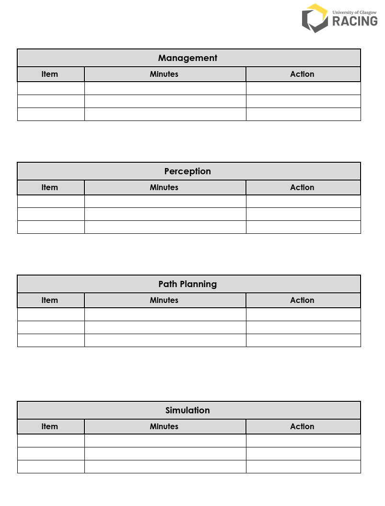

# Software Process

## Sub-teams

Based on the software architecture, Driverless is split into several sub-teams depending on the current state of the codebase. Currently, we have:

- Perception
- Path Planning & Control
- Simulation

In the past, there has been:

- State Estimation
- Mapping
- Motion & Control
- Racing line

However these have been either replaced or renamed based on the needs of the team and the strengths of its members. Each sub-team has a corresponding sub-team head, who oversees and manages the progress.

The rationale for splitting into sub-teams is that it is much easier to manage a team of around 5-7 developers, rather than all 20-30 at once. This also allows people to focus and develop their expertise in a certain area rather than being scattered throughout the codebase.

## Stand-ups

The sub-team heads along with Driverless management hold stand-up-esque meetings, in which progress of the past week and plans for the next week are discussed. Meetings are scheduled for points that require further discussion, to keep time spent in the stand-up meeting to a minimum. And we bring snacks :)

### Minutes

The minutes documents are split into sections for general team updates, and then more specific sub-team updates.
At the start of the meeting, each attendee fills in a shared document for meeting minutes. This includes the title of the item, a more detailed minutes section, and the action(s) needed. This provides a good way to document what was talked about, so that it is easier to refer to later, as well as allows us to track progress week to week (in addition to issues and milestones), particularly from a management side of things.

## Issues

Issues are created when a problem is identified, and there is a issue template used to try and provide a good level of information. The aim is to "triage" issues so that ideally anyone can pick one up without needing too much guidance from whoever created it, etc.

Issues are tagged according to their sub-team, as well as the stage of the issue:

- **Issue triage**: in the process of being created
- **Ready for Development**: ready to be developed
- **In Development**: in development
- **In Review / Testing**: open MR

### Linking to branches

Each issue should be linked to a branch that starts with the same number as the issue number, e.g. issue number `795` has branch name `795-gradcam-for-yolov8`.

## Merge requests

Each merge request should be borne of an issue, and someone who has expertise / knowledge in the area that the issue changes should be requested as reviewer. Multiple people can of course be requested.

Once the pipeline passes, all threads are resolved, and the MR is approved, the branch is good to be merged.

## Coding nights

Coding nights are a nice way to get everyone together, generally as well as on UGR code. This makes it easier for people to ask questions since lots of people with different areas of expertise are there.

It facilitates spontaneous pair / mob programming, as well as generally being quite morale boosting and fun :)